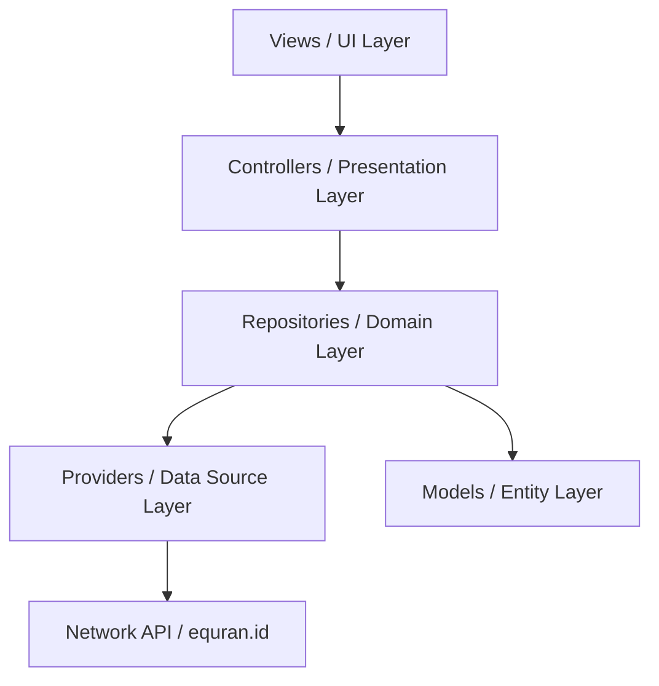

# Dokumentasi Pengembangan: Al-Qur'an Digital

Dokumen ini berfungsi sebagai panduan arsitektur, standar desain, spesifikasi sistem, dan petunjuk pemeliharaan proyek **Al-Qur'an Digital** berbasis Flutter.

---

## 1. Arsitektur Proyek (Clean Architecture + GetX)

Aplikasi ini menggunakan pola modular yang memisahkan tanggung jawab berdasarkan modul fitur, dikombinasikan dengan prinsip Clean Architecture di lapisan data.



### Struktur Direktori (`lib/app`)

*   **`/components`**: Widget global yang bersifat reusable (tidak terikat pada modul tertentu).
    *   `widgets/`: Berisi `CustomLoader`, `CustomAlert`, dan `CustomToast` (Dynamic Island style).
*   **`/constants`**: Desain sistem aplikasi dan token global.
    *   `R/`: Token warna (`app_color.dart`), gaya tulisan (`app_text_style.dart`), gambar aset (`asset_images.dart`), dan string teks (`strings.dart`).
    *   `r.dart`: Gerbang utama (Gateway) untuk mengakses seluruh elemen di folder `R`.
*   **`/data`**: Modul komunikasi data dan parsing.
    *   `models/`: Struktur data JSON objek seperti `surah_model.dart` dan `detail_surah_model.dart`.
    *   `providers/`: Objek `GetConnect` untuk memanggil endpoint API.
    *   `repositories/`: Logika bisnis pemrosesan data sebelum disajikan ke controller.
*   **`/modules`**: Modul halaman independen (View, Controller, Binding).
    *   `home/`: Tab Surah (dengan pencarian & pagination), Terakhir Dibaca, Bookmark, dan Sidebar menu.
    *   `detailSurah/`: Memuat teks ayat per 20 data secara dinamis menggunakan ScrollController.
    *   `doa/`: Kumpulan doa harian syar'i beserta filter pencarian.
    *   `splash/`: Splash screen interaktif dengan transisi logo memudar.
*   **`/routes`**: Pengaturan navigasi rute aplikasi (`app_pages.dart` dan `app_routes.dart`).

---

## 2. Desain Sistem & Konfigurasi Global (`R`)

Akses aset, warna, gaya huruf, dan teks statis dipusatkan lewat singleton `R`. Hal ini memudahkan pemeliharaan tanpa harus mengubah file UI secara manual.

### Standar Pemanggilan Desain Token
*   **Warna**: `R.color.gold`, `R.color.bg1`, `R.color.emerald`
*   **Teks Statis**: `R.string.appTitle`, `R.string.tryAgain`
*   **Gaya Huruf**: `R.textStyle.medium(color: Colors.white)`

### Sistem Warna Dinamis (Light & Dark Mode)
Aplikasi mendukung peralihan tema yang adaptif di mana `AppColor` mendeteksi status tema aktif melalui `ThemeController` dan menyajikan warna yang sesuai:
*   **Mode Terang (Light Mode)**: Menggunakan rasio kontras tinggi yang ramah bagi pengguna lansia. Warna teks utama disesuaikan menjadi lebih gelap tajam (`Color(0xFF193222)`) di atas latar belakang putih bersih untuk memastikan keterbacaan optimal.
*   **Mode Gelap (Dark Mode)**: Menggunakan warna latar belakang hijau gelap premium (`Color(0xFF0D1F17)`) dengan teks berwarna sage lembut (`Color(0xFFD8E8D8)`) guna menghindari mata lelah di kondisi cahaya redup.

---

## 3. Fitur Utama & Strategi Implementasi

### A. Dynamic Search & Pagination (Daftar Surah)
*   Daftar Surah dimuat secara paginasi (10 data per halaman). Ketika pengguna melakukan scroll hingga batas bawah, Controller secara otomatis memuat 10 data berikutnya.
*   Input pencarian disinkronkan secara reaktif (`searchQuery.obs`). Jika pencarian aktif, pagination dinonaktifkan sementara dan daftar disaring instan berdasarkan nama latin surah.

### B. Lazy Loading Teks Ayat (Detail Surah)
*   Saat detail surah pertama kali dibuka, aplikasi hanya merender **20 ayat pertama**.
*   Menggunakan listener pada `ScrollController`, saat pengguna mendekati batas bawah scroll, controller memicu penambahan 20 ayat berikutnya secara berkala (*lazy loading*).

### C. Animasi Transisi Tema Premium
*   Peralihan mode tema dikendalikan oleh tombol matahari/bulan di pojok kanan atas `HomeView` dan `DetailSurahView`.
*   Tombol ini dibungkus menggunakan `AnimatedSwitcher` yang memadukan **`RotationTransition`** (berputar 360 derajat) dan **`ScaleTransition`** (membesar/mengecil) secara simultan dengan durasi **500 milidetik**, memberikan efek visual pergantian tema yang sangat responsif dan premium.

### D. Notifikasi Adzan Latar Belakang (Background Prayer Notifications)
*   Penjadwalan waktu sholat menggunakan plugin `flutter_local_notifications` dan dikelola melalui `NotificationHelper`.
*   Jadwal sholat harian diperoleh dari GPS koordinat, kemudian disimpan ke database lokal dan dijadwalkan secara otomatis menggunakan alarm eksak (`zonedSchedule` dengan mode `AndroidScheduleMode.exactAllowWhileIdle`).
*   Menggunakan audio adzan kustom (`adzhan.mp3`) yang tersimpan di resource asli perangkat Android (`res/raw/adzhan.mp3`).

---

## 4. Reusable Premium Components (`/components/widgets`)

Aplikasi dilengkapi dengan tiga komponen visual premium kelas dunia:

| Komponen | Nama File | Cara Memanggil | Deskripsi Visual |
| :--- | :--- | :--- | :--- |
| **Custom Loader** | `custom_loader.dart` | `CustomLoader(size: 50)` atau `CustomLoader.show(context)` | Animasi bintang **Rub el Hizb** (8-pointed Islamic star) berdenyut di dalam lingkaran cincin gradasi berputar. |
| **Custom Alert** | `custom_alert.dart` | `CustomAlert.show(context, title: ..., message: ...)` | Dialog glassmorphic gelap bernuansa emas-hijau dengan animasi membesar (*scale transition*) saat terbuka. |
| **Custom Toast** | `custom_toast.dart` | `CustomToast.show(context, message: ...)` | Toast melayang bertema **Dynamic Island** (iPhone) yang mengembang elastis dari takik kamera atas. Menggunakan warna teks statis agar selalu kontras di atas latar gelap Dynamic Island baik pada Light maupun Dark Mode. |

---

## 5. Spesifikasi Teknis Minimum Android

Untuk dapat memasang dan menggunakan aplikasi Al-Qur'an Digital dengan lancar, perangkat Android Anda harus memenuhi standar spesifikasi berikut:

*   **Sistem Operasi (OS)**: Minimum **Android 5.0 (Lollipop, API Level 21)**. Direkomendasikan **Android 10.0 (API Level 29) atau lebih tinggi** untuk kompatibilitas perizinan notifikasi & alarm yang lebih aman.
*   **Memori (RAM)**: Minimal **2 GB** (Rekomendasi **3 GB ke atas**).
*   **Sensor Perangkat**:
    *   **GPS (Location Services)**: Diperlukan agar fitur deteksi lokasi otomatis dapat menentukan jadwal sholat & imsakiyah lokal secara real-time.
    *   **Magnetometer (Kompas)**: Wajib dimiliki HP agar fitur **Arah Kiblat** dapat memutar jarum penunjuk Ka'bah secara akurat di layar HP.
*   **Kapasitas Penyimpanan**: Sekitar **40–60 MB** ruang kosong. File murattal diputar secara streaming online sehingga tidak membebani memori internal perangkat.

---

## 6. Panduan Pengaktifan & Pemecahan Masalah Adzan

> [!IMPORTANT]
> Sistem operasi Android memiliki perlindungan baterai dan pembatasan background yang ketat. Jika notifikasi adzan tidak bersuara atau tidak muncul saat aplikasi ditutup, silakan ikuti petunjuk berikut:

### A. Daftarkan Ulang Channel Notifikasi (Clear Cache)
Android mengunci konfigurasi suara notifikasi pada setiap ID channel yang terdaftar. Jika Anda melakukan perubahan file audio, Anda harus membuat channel ID baru atau menginstal ulang aplikasi.
*   **Solusi**: Hapus instalan (*uninstall*) aplikasi dari HP Anda terlebih dahulu, kemudian pasang (*install*) kembali untuk memastikan registrasi ulang channel **`sholat_channel_v3`** yang baru.

### B. Matikan Optimasi Baterai untuk Aplikasi
Sistem Android sering mematikan paksa tugas terjadwal aplikasi jika dianggap mengonsumsi daya baterai latar belakang.
1.  Buka **Pengaturan HP** -> **Aplikasi** -> pilih **Al-Quran Digital**.
2.  Buka menu **Baterai** / **Penghemat Baterai**.
3.  Ubah opsi menjadi **Tidak Dibatasi** / **Unrestricted**.
4.  (Khusus HP Xiaomi, Oppo, Vivo) Aktifkan menu **Mulai Otomatis / Autostart**.

### C. Berikan Akses Izin Alarm Eksak
Aplikasi memerlukan izin sistem untuk memicu alarm tepat waktu saat jam sholat tiba.
*   Masuk ke **Pengaturan HP** -> **Akses Aplikasi Khusus** -> **Alarm & Pengingat** (*Special App Access -> Alarms & Reminders*).
*   Aktifkan tombol izin untuk aplikasi **Al-Quran Digital**.

---

## 7. Pemeliharaan & Pengujian

Setiap penambahan fitur baru disarankan untuk selalu:
1.  Memasukkan teks statis ke dalam `lib/app/constants/R/strings.dart`.
2.  Memasukkan warna baru ke dalam `lib/app/constants/R/app_color.dart`.
3.  Memastikan program lulus uji analisis statis dengan menjalankan:
    ```bash
    flutter analyze
    ```
