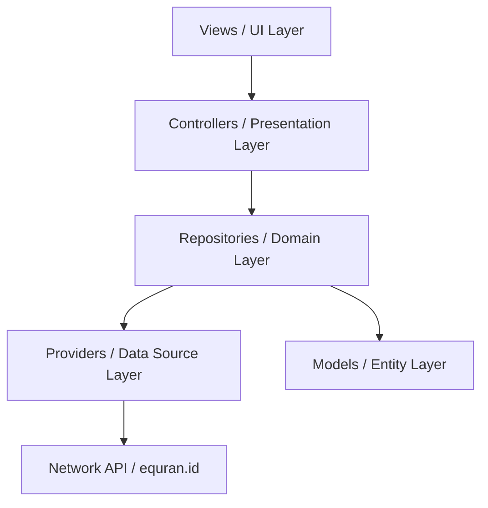

# Dokumentasi Pengembangan: Al-Qur'an Digital

Dokumen ini berfungsi sebagai panduan arsitektur, standar desain, dan referensi komponen bagi tim pengembang untuk menjaga konsistensi dan skalabilitas kode proyek **Al-Qur'an Digital**.

---

## 1. Arsitektur Proyek (Clean Architecture + GetX)

Aplikasi ini menggunakan pola modular yang memisahkan tanggung jawab berdasarkan modul fitur, dikombinasikan dengan prinsip Clean Architecture di lapisan data.



### Struktur Direktori (`lib/app`)

*   **`/components`**: Widget global yang bersifat reusable (tidak terikat pada modul tertentu).
    *   `widgets/`: Berisi `CustomLoader`, `CustomAlert`, dan `CustomToast` (Dynamic Island style).
*   **`/constants`**: Desain sistem aplikasi dan token global.
    *   `R/`: Token warna (`app_color.dart`), gaya tulisan (`app_text_style.dart`), gambar aset (`asset_images.dart`), dan string teks (`strings.dart`).
    *   `r.dart`: Gerbang utama (Gateway) untuk mengakses seluruh elemen di folder `R`.
*   **`/data`**: Modul komunikasi data dan parsing.
    *   `models/`: Struktur data JSON objek seperti `surah_model.dart` dan `detail_surah_model.dart`.
    *   `providers/`: Objek `GetConnect` untuk memanggil endpoint API.
    *   `repositories/`: Logika bisnis pemrosesan data sebelum disajikan ke controller.
*   **`/modules`**: Modul halaman independen (View, Controller, Binding).
    *   `home/`: Tab Surah (dengan pencarian & pagination), Terakhir Dibaca, Bookmark, dan Sidebar menu.
    *   `detailSurah/`: Memuat teks ayat per 20 data secara dinamis menggunakan ScrollController.
    *   `doa/`: Kumpulan doa harian syar'i beserta filter pencarian.
    *   `splash/`: Splash screen interaktif dengan transisi logo memudar.
*   **`/routes`**: Pengaturan navigasi rute aplikasi (`app_pages.dart` dan `app_routes.dart`).

---

## 2. Desain Sistem & Konfigurasi Global (`R`)

Akses aset, warna, gaya huruf, dan teks statis dipusatkan lewat singleton `R`. Hal ini memudahkan pemeliharaan tanpa harus mengubah file UI secara manual.

### Standar Pemanggilan Desain Token
*   **Warna**: `R.color.gold`, `R.color.bg1`, `R.color.emerald`
*   **Teks Statis**: `R.string.appTitle`, `R.string.tryAgain`
*   **Gaya Huruf**: `R.textStyle.medium(color: Colors.white)`

### Pengaturan Font Family Global
Aplikasi menggunakan font **Poppins** sebagai standar dasar. Konfigurasi ini terintegrasi secara global di dalam generator text style (`app_text_style.dart`), sehingga pemanggilan di UI cukup ringkas tanpa perlu menuliskan properti `fontFamily` berulang-ulang:
```dart
// Contoh penggunaan text style yang otomatis menggunakan Poppins:
Text(
  'Teks Contoh',
  style: R.textStyle.medium(
    fontWeight: FontWeight.w600,
    color: R.color.goldLight,
  ),
)
```

---

## 3. Fitur Utama & Strategi Implementasi

### A. Dynamic Search & Pagination (Daftar Surah)
*   **Masalah**: Memuat 114 surah sekaligus beserta detail lengkapnya di Home View berpotensi memicu lag pada perangkat dengan spesifikasi rendah.
*   **Solusi**: 
    1.  Daftar Surah dimuat secara paginasi (10 data per halaman).
    2.  Ketika pengguna melakukan scroll hingga batas bawah, Controller mendeteksi dan secara otomatis memuat 10 data berikutnya.
    3.  Terdapat tombol interaktif "Kembali Ke Atas" yang muncul secara reaktif di bagian bawah jika posisi scroll cukup jauh.
    4.  Input pencarian disinkronkan secara reaktif (`searchQuery.obs`). Jika input aktif, pagination dinonaktifkan sementara dan daftar surah disaring secara instan berdasarkan nama latin surah untuk memudahkan pencarian cepat.

### B. Lazy Loading Teks Ayat (Detail Surah)
*   **Masalah**: Surah berukuran besar (seperti Al-Baqarah dengan 286 ayat) membutuhkan waktu rendering awal yang lama jika seluruh data dimuat sekaligus.
*   **Solusi**:
    1.  Saat detail surah pertama kali dibuka, aplikasi hanya merender **20 ayat pertama**.
    2.  Menggunakan listener pada `ScrollController`, saat pengguna mendekati batas bawah scroll, controller akan memicu penambahan 20 ayat berikutnya secara berkala (*lazy loading*).
    3.  Selama proses memuat halaman berikutnya, `CustomLoader` ukuran mini disajikan di bagian bawah sebagai umpan balik visual yang premium.

---

## 4. Reusable Premium Components (`/components/widgets`)

Aplikasi dilengkapi dengan tiga komponen visual premium kelas dunia:

| Komponen | Nama File | Cara Memanggil | Deskripsi Visual |
| :--- | :--- | :--- | :--- |
| **Custom Loader** | `custom_loader.dart` | `CustomLoader(size: 50)` atau `CustomLoader.show(context)` | Animasi bintang **Rub el Hizb** (8-pointed Islamic star) berdenyut di dalam lingkaran cincin gradasi berputar. |
| **Custom Alert** | `custom_alert.dart` | `CustomAlert.show(context, title: ..., message: ...)` | Dialog glassmorphic gelap bernuansa emas-hijau dengan animasi membesar (*scale transition*) saat terbuka. |
| **Custom Toast** | `custom_toast.dart` | `CustomToast.show(context, message: ...)` | Toast melayang bertema **Dynamic Island** (iPhone) yang mengembang elastis dari takik kamera atas dan menyusut kembali saat ditutup. |

---

## 5. Pemeliharaan & Git Commit Guidelines

Setiap penambahan fitur baru disarankan untuk selalu:
1.  Memasukkan teks statis ke dalam `lib/app/constants/R/strings.dart`.
2.  Memasukkan warna baru ke dalam `lib/app/constants/R/app_color.dart`.
3.  Memastikan program lulus uji analisis statis dengan menjalankan:
    ```bash
    flutter analyze
    ```
4.  Melakukan build verifikasi sebelum merilis atau menggabungkan kode:
    ```bash
    flutter build bundle
    ```
